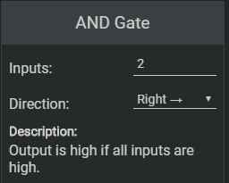

# Einstieg

Logigator is ein Tool um Logische Schaltkreise zu bauen und direkt im Browser oder in einer nativen Desktop Applikation zu simulieren.

Egal ob du ein blutiger Anfänger bist der hier erste Lernerfolge erzielt oder ein absoluter Profi der Top-Performance für seine Simulationen benötigt - Logigator ist die Antwort!

## Erstellen eines Schaltungselements

Um ein Schaltungselement zu erstellen selektieren Sie das gewollte Element es aus dem Baukasten, der sich auf der linken Seite des Editors befindet. 
  

Nachdem Sie ein Element ausgewählt haben, können Sie es mit einem Klick in den Arbeitsbereich platzieren.

Es ist auch möglich ein Element im Arbeitsbereich zu verschieben bevor es platziert wird. Um dies zu machen, halten Sie einfach Ihre Maustaste gedrückt und verschieben die Maus. Wenn die Taste losgelassen wird, wird das Element platziert.

## Bearbeiten von Schaltungselementen

Platzierte Elemente können in der Einstellungsbox am rechten unteren Rand des Editor bearbeitet werden.

Dort kann man Einstellungen wie die Richtung, Anzahl der Eingänge oder Anzahl der Ausgänge konfigurieren.

## Zoomen und Verschieben des Arbeitsbereichs

Der Arbeitsbereich kann durch scrollen des Mausrades oder durch klicken der `+` oder `-` Buttons gezoomt werden.

Um die Ansicht zu verschieben drücken Sie einfach Ihre linke Maustaste hinunter und bewegen Ihre Maus.

## Auswählen von Elementen
Um Elemente auszuwählen klicken Sie auf das gewollte Elemente oder ziehen mit der linken Maustaste ein Auswahlrechteck.
